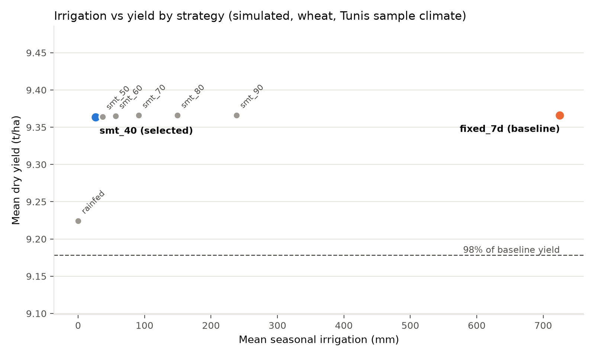
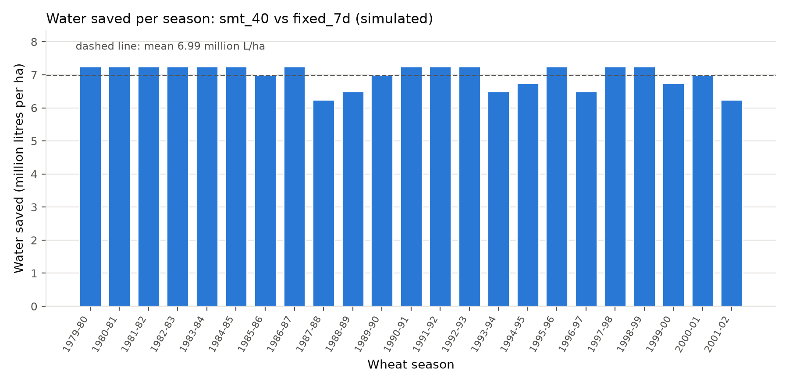
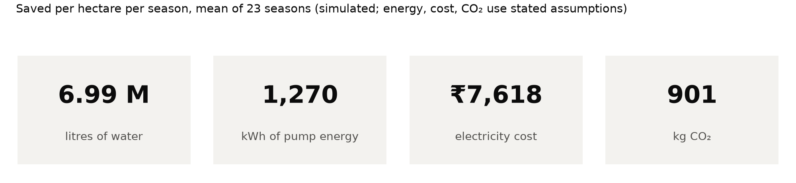

<!-- GENERATED FILE: edit docs/templates/README.template.md, then run `python analyze.py` (or `python render_docs.py`). Every number below comes from results/impact.json. -->

# SmartIrrigate

**Soil-moisture-driven irrigation scheduling for water savings: a simulation study on AquaCrop-OSPy.**

Submission for EcoLogic 1.0 Sustainability Hackathon, theme Smart Agriculture.

> **All results in this repository are SIMULATED** with the FAO AquaCrop crop-water model
> (Python port AquaCrop-OSPy). They are not field measurements. The weather is the
> AquaCrop-OSPy bundled sample climate for **Tunis, Tunisia**, not an Indian location.

## Problem

Many farmers irrigate on a fixed calendar: a set depth of water every few days, whatever the
weather or the state of the soil. When rain has already wetted the root zone, that water drains
below the roots or evaporates. The waste is twofold: the water itself, and the electricity used
to pump it.

## Solution

A **soil-moisture-threshold scheduler**: irrigate only when the root zone has dried below a set
fraction of its available water, and then refill it. We compare it against a fixed-interval,
farmer-style baseline across 23 simulated wheat seasons and translate the difference into
litres, kWh, rupees and kg CO₂ per hectare per season.

The same rule can run in the field on a low-cost soil-moisture sensor and a pump relay; see
[docs/DEPLOYMENT_PATH.md](docs/DEPLOYMENT_PATH.md). That hardware is **not built or tested** in this
submission.

## How it works

1. `run_experiment.py` runs 8 strategies through AquaCrop-OSPy over the same 23 wheat seasons
   (1979-80 to 2001-02), same soil (SandyLoam) and same weather, and saves per-season
   yield and irrigation to `results/results.csv`.
   - `rainfed`: no irrigation (reference)
   - `fixed_7d` (baseline): 25 mm every 7 days from planting, as a predefined schedule
   - `smt_40` … `smt_90`: irrigate when root-zone water falls below 40 … 90 % of total available water
2. `analyze.py` applies a selection rule that was **fixed before any results were seen**, computes
   savings and writes `results/impact.json`, `results/selection.json` and the charts.
3. `build_deck.py` builds the presentation from the same `impact.json`.

**Selection rule:** Choose the SMT strategy with the lowest mean seasonal irrigation (mm) among those whose mean dry yield is at least 98% of the fixed_7d mean yield. If none qualify, report that plainly and show the best yield-preserving trade-off without claiming it meets the rule.

**Rule met: Yes.** Selected scheduler: `smt_40`.

## Results (simulated, per hectare per season, mean of 23 seasons)

| Metric | Baseline `fixed_7d` | Scheduler `smt_40` |
|---|---|---|
| Irrigation (mm) | 725 | 26.1 (range 0 to 100, SD 35.7) |
| Dry yield (t/ha) | 9.37 (range 8.31 to 10.18) | 9.36 (range 8.31 to 10.18) |
| Irrigation water productivity (kg grain per m³ irrigation) | 1.29 | 35.9 |

| Saving vs baseline | Mean | Range across seasons |
|---|---|---|
| Water | **6,989,130 L/ha** (699 mm, 96% of baseline) | 6,250,000 to 7,250,000 L/ha (SD 357,376) |
| Pump energy | **1,270 kWh/ha** | 1,135 to 1,317 kWh/ha |
| Electricity cost | **₹7,618/ha** | ₹6,812 to ₹7,902/ha |
| CO₂ | **901 kg/ha** | 806 to 935 kg/ha |
| Yield change | -0.002 t/ha (-0.03%) | |

Paired season-by-season comparison: the scheduler used less water in **23 of 23** seasons and
kept yield within 2 % of the baseline in **23 of 23** seasons.

Energy, cost and CO₂ use assumed values: pump head 30 m, pump efficiency 0.45
(= 0.182 kWh/m³), tariff ₹6.00/kWh, grid factor 0.71 kg CO₂/kWh. Sensitivity to pump head:

| Pump head | kWh per m³ | kWh saved/ha/season | ₹ saved/ha/season | kg CO₂ saved/ha/season |
|---|---|---|---|---|
| 15 m | 0.091 | 635 | ₹3,809 | 451 |
| 30 m | 0.182 | 1,270 | ₹7,618 | 901 |
| 60 m | 0.363 | 2,539 | ₹15,236 | 1,803 |

### Read this before quoting the headline number

- **In this sample climate the crop is barely water-limited.** Rainfed wheat already reaches
  9.22 t/ha, 98.5% of the baseline yield. So most of the saving comes from the
  baseline applying far more water than the crop needs, not from clever scheduling. In a drier climate,
  or against a leaner baseline, the saving would be smaller.
- The selected scheduler irrigated nothing in 13 of 23 seasons, so its very high
  water productivity mainly reflects rainfall doing the work.
- The full strategy table shows the gradient; even the most generous threshold (`smt_90`) uses far less
  water than the baseline:

| Strategy | Mean irrigation (mm/season) | Mean dry yield (t/ha) |
|---|---|---|
| `rainfed` | 0.0 | 9.22 |
| `fixed_7d` (baseline) | 725.0 | 9.37 |
| `smt_40` (selected) | 26.1 | 9.36 |
| `smt_50` | 37.0 | 9.36 |
| `smt_60` | 56.4 | 9.37 |
| `smt_70` | 91.2 | 9.37 |
| `smt_80` | 149.6 | 9.37 |
| `smt_90` | 238.4 | 9.37 |

### Charts







## How to run

Tested on Python 3.12.4 (Windows). Python 3.10 and 3.11 were not tested.

```bash
pip install -r requirements.txt
python run_experiment.py   # ~3 minutes; writes results/results.csv
python analyze.py && python build_deck.py   # impact.json, charts, README, video script, deck
```

Tests: `pytest`.

## Data source

Weather: `tunis_climate.txt`, the sample daily climate file bundled with AquaCrop-OSPy
(Tunis, Tunisia, 1979 to 2002). **Simulated; not Jaipur and not any Indian site.** Crop and soil
parameters: AquaCrop-OSPy built-in `Wheat` and `SandyLoam`.

## Assumptions

Every assumption lives in `config.py` with the tag `# ASSUMPTION - verify before submission`.
Details and verification status: [docs/ASSUMPTIONS.md](docs/ASSUMPTIONS.md).

| Assumption | Value | Status |
|---|---|---|
| Baseline depth per irrigation | 25 mm | to verify |
| Baseline interval | 7 days | to verify |
| Pump total head | 30 m (sensitivity 15 / 30 / 60 m) | to verify |
| Overall pump-set efficiency | 0.45 | to verify |
| Electricity tariff | ₹6.00/kWh (placeholder) | to verify |
| Grid emission factor | 0.71 kg CO₂/kWh (placeholder) | to verify |
| Application efficiency | 100 % for all strategies (model default) | modelling choice |
| Max irrigation per day | 25 mm for all strategies (model default) | modelling choice |

## Limitations

- **Simulated results only.** No field data; the model has not been calibrated to any farm.
- **Sample climate, not local.** Tunis weather from 1979 to 2002, not an Indian site.
- **Single crop and soil.** Wheat on sandy loam only.
- **Modest innovation.** Threshold-based soil-moisture scheduling is a well-known technique; the
  contribution here is a transparent, reproducible quantification of its savings, not a new algorithm.
- **No economic model beyond the stated assumptions.** No capital cost, payback, subsidy, labour or
  water-price modelling; tariffs and emission factors are placeholders until verified.
- The baseline is one stylised farmer schedule; real practice varies widely and drives the size of the saving.

## Credits

- [AquaCrop-OSPy](https://github.com/aquacropos/aquacrop) (Apache License 2.0), the Python
  implementation of the FAO AquaCrop model used for all simulations. This project uses its public API;
  no tutorial code is copied.
- FAO AquaCrop crop-water productivity model (Food and Agriculture Organization of the United Nations).

## License

Source code in this repository: MIT, see [LICENSE](LICENSE). AquaCrop-OSPy is a separate dependency
under Apache 2.0.

## More documentation

- [docs/METHODOLOGY.md](docs/METHODOLOGY.md): model setup, verified API behaviour, formulas
- [docs/ASSUMPTIONS.md](docs/ASSUMPTIONS.md)
- [docs/DEPLOYMENT_PATH.md](docs/DEPLOYMENT_PATH.md)
- [docs/VIDEO_SCRIPT.md](docs/VIDEO_SCRIPT.md)
- [docs/SUBMISSION_CHECKLIST.md](docs/SUBMISSION_CHECKLIST.md)
